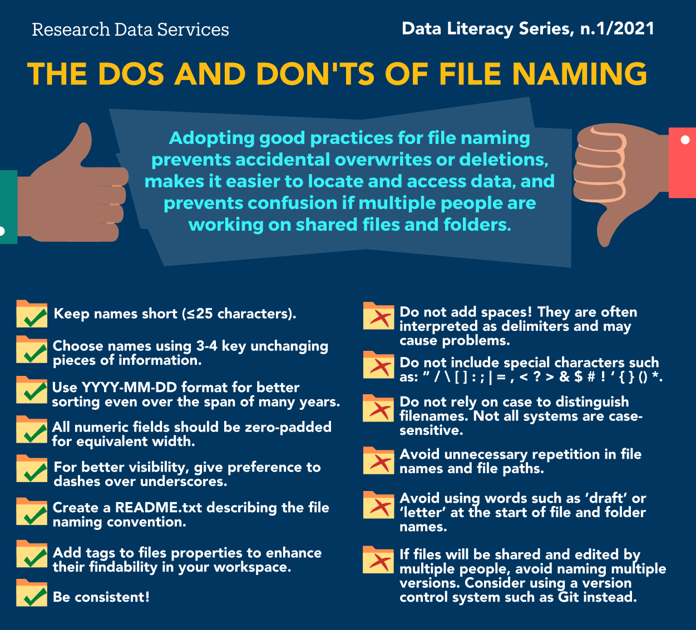

# Naming Convention File Name Examples

PDF-Dokument:

- [YYYY-MM-DD]\_[DESCRIPTION]\_[VERSIONNUMBER]\_[AUTHOR] oder [YYYY]\_[DESCRIPTION]
- User_Manual.pdf
- 2023_Annual_Report.pdf
- Harvard.edu: 20190501_exp123_analysis_v01.pdf oder 2020-plos-manuscript-v26.pdf
- 2023-10-10_Verführ_SMIB_DiGru_Sitzung_4-Protokoll_bestätigt_OK.pdf

PNG-Bild:

- [figure]\_[description]-[description] oder [date]-[description]-[description]-[versionnumber] oder [description]-[description] (lower case)
- Date ist meist nur das Jahr
- Harvard.edu -> Datacarpentry.org: fig01_scatterplot-talk-length-vs-interest.png oder fig02_histogram-talk-attendance.png

JPG-Bild:

- [figure]\_[description]-[description] oder [date]-[description]-[description]-[versionnumber] oder [description]-[description] (lower case)
- family-picnic.jpg
- 2023-smith-family-spring-picnic.jpg

Word-Dokument:

- [YYYY-MM-DD]\_[DESCRIPTION]\_[VERSIONNUMBER]\_[AUTHOR] oder [YYYY]\_[DESCRIPTION]\_[VERSIONNUMBER]
- Meeting_Minutes.docx
- Quarterly_Board_Meeting_Minutes_2023.docx
- Harvard.edu: 2016-01-04_ProjectA_MeetingNotes_v2_SmithE.docx

Excel-Tabelle:

- [YYYY-MM-DD]\_[DESCRIPTION]\_[VERSIONNUMBER]\_[AUTHOR] oder [YYYY]\_[DESCRIPTION]\_[VERSIONNUMBER]
- 2022-10-05_Budget_Spreadsheet_v1_MM.xlsx
- 2023_Financial_Projections_Budget.xlsx

PowerPoint-Präsentation:

- [YYYY-MM-DD]\_[FRISTNAME_SURNAME]\_[TOPIC]
- 2022-11-2_Oliver_Kiel_Beeinflussungsstrategien.pptx

Textdatei:

- [date]-[description]-[description]-[versionnumber] oder [description]-[description] (lower case but README, COPYING, LICENSE, etc.)
- projektbeschreibung.txt
- 2023-ideen-webentwicklungsprojekt-v1.txt
- Harvard.edu -> Datacarpentry.org: 1986-01-28-raw-data-from-challenger-o-rings.txt

ZIP-Archiv:

- [YYYY-MM-DD]-[DESCRIPTION]-[VERIONNUMBER]
- backup.zip
- 2022-10-05-monthly-backup-archive.zip

PowerShell-Skript (.ps1):

- [VERB]-[DESCRIPTION] oder [DESCRIPTION]
- Check-PSCompatibility.ps1
- Copy-ADGroupMember.ps1
- ModuleFast.ps1

PowerShell-Modul (.psm1):

- [VERB]-[DESCRIPTION] oder [DESCRIPTION]
- Set-PsEnv.psm1
- PSWebServer.psm1

Batch-Datei (.bat):

-[description]-[description] (lower case)
- script.bat
- backup-routine-script.bat

Markdown-Datei (.md):

- [description]-[description] (lower case)
- project.md

Windows-Ordner:

- Am besten: [description]-[description] oder [date]-[description] (lower case)
  - project-dokuments
- Geht auch: [DESCRIPTION]-[DESCRIPTION] oder [DATE]-[DESCRIPTION]
  - Project-Documents
- **Oder: [CamelCase]**
  - ProjectDocuments
    - Finde ich zurzeit schöner & ich bin in Java zurzeit am besten

MP3-Audiodatei:

- 
- 

MP4-Videodatei:

- 
- 

HTML-Webseite:

- 
- 

CSV-Datei:

- 
- 
- Harvard.edu -> Datacarpentry.org: 2013-06-26_BREAFWTNEGASSAY_Plasmid-Celline-100-1MutantFraction_platefile.csv oder 2014-02-26_BRAWTNEGASSY_FFPEDNA-CRC-1-41_A01.csv

SQL-Skript:

- 
- 

GIF-Bild:

- 
- 

XML-Konfigurationsdatei:

- 
- 

JSON-Daten:

- 
- 

RTF-Textdokument:

- 
- 

# Harvard File Naming Conventions

<a href="https://datamanagement.hms.harvard.edu/plan-design/file-naming-conventions">File Naming Convention Harvard.edu</a>

- Identify what group of files your naming convention will cover
- You can use different conventions for different file sets
- Check for established file naming conventions in your discipline oder group
- Think about how you will search for your files
- **Write down your naming conventions!!!**

## Use versioning

- Use versioning to indicate the most current version of a file
- Track versions of a file by adding version information to end of the file name, e.g. filename_v2.xxx
- Use a version number (e.g. “v01” or “v02”)
- Use the version date (use ISO 8601 format: YYYYMMDD oder YYYY-MM-DD)

## Use abbreviations and document them!

- mouse = “MUS”, fruit fly = “DRS”

## Deliberately separate metadata elements

- Use dashes (-), underscores (_), oder capitalize the first letter of each word
  - Dashes: file-name.xxx
  - Underscores: file_name.xxx
  - No separation: filename.xxx
  - Camel case (the first letter of each section of text is capitalized): FileName.xxx
- Avoid special characters, such as: ~ ! @ # $ % ^ & * ( ) ` ; : < > ? . , [ ] { } ' " |

## Three principles for (file) names:

<a href="https://datacarpentry.org/rr-organization1/01-file-naming/index.html">Harvard.edu -> Datacarpentry.org File Naming</a>

- Machine readable
- Human readable
- Plays well with default ordering

### Machine readable

- Regular expression and globbing friendly
  - Avoid spaces, punctuation, accented characters, case sensitivity
  - Easy to compute on
- Deliberate use of delimiters
- Easy to search for files later
- Easy to narrow file lists based on names
- Easy to extract info from file names, e.g. by splitting
- New to regular expressions and globbing? Be kind to yourself and avoid
  - Spaces in file names
  - Punctuation
  - Accented characters
  - Different files named foo and Foo

### Human readable

- Name contains info on content
- Connects to concept of a slug from semantic URLs

### Punctuation

Deliberate use of “-“ and “_” allows recovery of meta-data from the filenames:

- “_” underscore used to delimit units of meta-data I want later.
- ”-“ hyphen used to delimit words so my eyes don’t bleed.

### Plays well with default ordering

- Put something numeric first
- Use the ISO 8601 standard for dates
- Left pad other numbers with zeros

 
 

# File Naming Best Practices

[File Naming Best Practices tru.ca](https://www.tru.ca/__shared/assets/file-naming-best-practices-46019.pdf)

The most important things to remember about file naming are to be consistent
and descriptive in naming and organizing your files so that it’s obvious where
to find a file and what it contains.

## Information to consider including in file names

1. Topic or Project name
2. Author’s name/initials
3. Date or date range
4. Type of record (e.g. newsletter)
5. Version number of document (e.g. v1)
   
These are suggestions; include whatever information will allow you to
distinguish your files from each other and clearly indicate to you what is in them.

## Other tips for file naming
1. A good format for dates is YYYYMMDD (or YYMMDD). This makes sure
all your files stay in chronological order, even over many years.
2. Don’t make file names too long; longer names do not work well with all
types of software.
3. Special characters should be avoided: ~ ! @ # $ % ^ & * ( ) ` ; < > ? , [ ] { } ‘
“
4. For sequential numbering, use leading zeros to ensure files sort
properly. For example, use “0001, 0002…1001, etc” instead of “1,
2…1001, etc.”
5. Do not use spaces, because they are not recognized by some
software. Instead use underscores (file_name), dashes (file --‐‐name),
no separation (filename or FileName).
Consider including a README.txt file in your directory that explains your
naming convention along with any abbreviations or codes you have used.

 
 

# Interesting Information

## A collection of guidelines for writing file names used in web projects
<a href="https://github.com/bartvandebiezen/file-name-conventions/blob/master/README.md">File Naming Conventions Github.com</a>

### Write sections of a file name in a consistent order

1. Description
2. Number
3. Date
4. Target device, image size, pixel density
5. Version number
6. Status
7. Language code
8. File conditions

## Word naming conventions

<a href="https://finance.uw.edu/recmgt/resources/file-folder-naming-conventions">File Folder Naming Coventions Finance.uw.edu</a>

 
 

# What I discovered or experienced

- Hypens are better to read and separate words better than underscores -> underscores are less noticeable
- <u>***Date on beginning -> chronological file sorting***</u>

 
 

# The Dos and Don'ts of file naming

